# Quick Start Guide: Tunnel Container Deployment with Dux-Jenkins Pipeline

## Overview

This guide helps you automate and simplify the deployment and management
of Tunnel server containers (and EIC, PAC Reader, SEG containers) using
Jenkins pipelines powered by Dux. The solution enables you to:

- Install Dux

- Update manifests for latest versions of Dux

- Manage configuration changes by leveraging a user-specific,
  version-controlled private repository

- Deploy containers to specified hosts

- Monitor container health

- Troubleshoot and collect logs

- Perform operations like stop, restart, and remove containers

- Use pipelines/jobs to further simplify and automate these tasks

## System Requirements

- **Linux VM1**: Jenkins and Dux installed (acts as the orchestrator)

- **Linux VM2 (1\...n)**: Target container hosts

- **Supported OS**: AlmaLinux, Ubuntu, Fedora (for Jenkins host)

- **Required Packages**: unzip, docker, python3, python3-pip

- **Network**: SSH connectivity between Jenkins VM and container hosts

- **GitHub**: Public repo for pipeline scripts, private repo for cluster
  credentials

  - <https://github.com/shobana-gt/dux-jenkins-pipeline>

  - **branch:** jenkins-dux-pipeline from the repo dux-jenkins-pipeline
    (<https://github.com/shobana-gt/dux-jenkins-pipeline/tree/jenkins-dux-pipeline>

  - **Github private repo for cluster credentials** - You need to create
    a private repo for cluster config files in
    [github.com](http://github.com/)
    .Example:<https://github.com/shobana-gt/sample-cluster-repo>

  - **Branch** : The config files will be uploaded to this branch if
    there is a change so that the old versions can be restored in
    future.

## Installation Steps

### 1. Prepare Jenkins Host (Linux VM1)

- Configure a Linux VM with Alma Linux/Ubuntu

- Install Jenkins: [Jenkins Linux Install
  Guide](https://www.jenkins.io/doc/book/installing/linux/)

- Install required packages:

> sudo apt-get install unzip docker.io python3 python3-pip

- Add Jenkins user to wheel and docker groups:

> sudo usermod -aG wheel,docker jenkins

- Ensure passwordless sudo for wheel group in /etc/sudoers:

> %wheel ALL=(ALL) NOPASSWD:ALL

- Restart Jenkins service if already running.

### 2. **Add GitHub\'s Public SSH Keys to** known_hosts

1.  **Locate GitHub\'s Public SSH Keys:**

    - Visit GitHub\'s official documentation for SSH key fingerprints:
      [GitHub\'s SSH key fingerprints: GitHub
      Documentation](https://docs.github.com/en/authentication/keeping-your-account-and-data-secure/githubs-ssh-key-fingerprints).

2.  **Add GitHub\'s Public SSH Keys to Jenkins\'** `known_hosts`

    - On the Jenkins host machine, open a terminal and run the following
      command to append GitHub\'s public SSH keys to the known_hosts
      file:

> ssh-keyscan github.com \>\> /var/lib/jenkins/.ssh/known_hosts

- This ensures that the Jenkins server can securely authenticate
  GitHub\'s host.

3.  **Verify the Keys:**

    - Open the known_hosts file to confirm the keys were added:

> cat /var/lib/jenkins/.ssh/known_hosts

- Ensure the file contains GitHub\'s public SSH keys.

4.  **Alternative Manual Option:**

    - If you prefer to manually add the keys:

      - Go to **Manage Jenkins** → **Security** → **GitHub SSH Keys**.

      - Use the manual option to provide all known hosts, including
        GitHub\'s public SSH keys.

### 3. Add SSH Private Key Credentials in Jenkins

1.  **Generate an SSH Key Pair (if not already created):**

    - On the Jenkins host machine, generate an SSH key pair:

> ssh-keygen -t rsa -b 4096 -C \"your_email@example.com\"

- Save the key pair in the default location
  (`/var/lib/jenkins/.ssh/id_rsa`) or specify a custom path.

- Copy the public key to your GitHub account:

  - Go to **GitHub** → **Settings** → **SSH and GPG Keys** → **New SSH
    Key**.

  - Paste the contents of the public key (`id_rsa.pub`) and save.

2.  **Add the Private Key to Jenkins Credentials:**

    - Log in to Jenkins as an administrator.

    - Navigate to **Manage Jenkins** → **Credentials** → **Global
      Credentials** → **Add Credentials**.

    - Select **SSH Username with Private Key** as the credential type.

3.  **Provide the Details:**

    - **ID/Name:** Enter the unique identifier `github-ssh-key` for the
      credentials as this is used by the pipelines

    - **Username:** Enter the GitHub username associated with the SSH
      key.

    - **Private Key:**

      - Select **Enter directly**.

      - Paste the contents of the private key file (`id_rsa`).

    - Click **Save**.

- Snapshot given below to refer for names of keys used by the pipelines

- 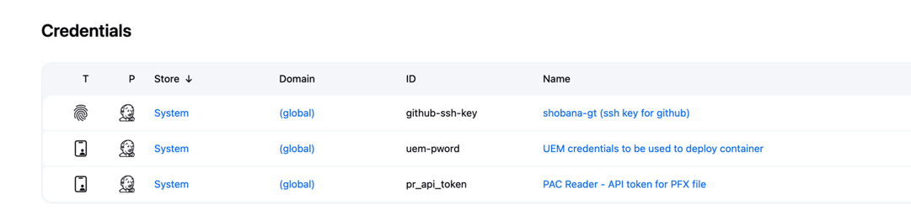

### 4. Install Required Jenkins Plugins

- [Job DSL](https://plugins.jenkins.io/job-dsl/) (and [Environment
  Injector](https://plugins.jenkins.io/envinject/))

- [Pipeline: Stage
  View](https://plugins.jenkins.io/pipeline-stage-view/) (recommended)

- [Rebuilder](https://plugins.jenkins.io/rebuild/) (recommended)

- [Folder](https://plugins.jenkins.io/cloudbees-folder/)

- [Blue Ocean](https://plugins.jenkins.io/blueocean/) [(optional - gives
  a better UI experience)]

- Install via: Manage Jenkins → Plugins → Available → Search & Install →
  Restart Jenkins

### 5. Prepare Linux VMs for Target container hosts

 The [Prerequisites](https://packages.omnissa.com/ws1-tunnel/dux/3.0.0.641/README.html#Prerequisites) section of Dux README gives a detailed instruction on how to set up the Linux container host and the Dux host. Please ensure all steps are followed.

## First-Time Setup - Jenkins

### 1. Fork and Customize Pipeline Scripts

- Fork <https://github.com/shobana-gt/dux-jenkins-pipeline>

- Update `seed.groovy` for your environment (cluster credentials repo, git
  user/email, download path, etc.)

### 2. Import and Run the Seed Job

- In Jenkins, create a new Freestyle project named `seed`

- Configure Source Code Management: Git, repo URL, credentials, correct
  branch (e.g., `\*/main, refs/heads/\<your_branch\>`)

- A snapshot of how seed is configured is given as example.

- 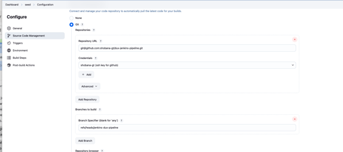

- Add build step: Process Job DSL → Look on filesystem → `seed.groovy`

- Save and build the job

- Approve any required scripts in Manage Jenkins → In-process Script
  Approval (if needed)

### 3. Create Additional Secrets

- Store secrets (e.g., UEM password) in Jenkins credentials as needed

## Generate Pipelines

- Running the `seed` job will create folders and jobs for each supported
  container type in Jenkins.

> 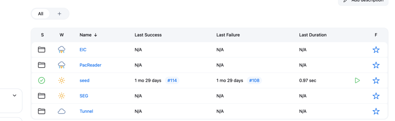

- Under each folder you will see jobs/pipelines corresponding to each
  container.

- 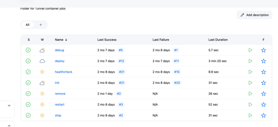

- Each job corresponds to a Dux operation (init, deploy, healthcheck,
  debug, stop, restart, remove).

- Note that if you are not updating the cluster repo / branch and using
  the scripts from main branch, defaults will be displayed. Hence it is
  important to Configure each job with your cluster repo -
  CLUSTER_CREDS_REPO, CLUSTER_BRANCH etc. Snapshot is given below:

- 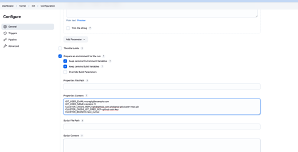

## Pipelines - How to Run Various Operations

### Tunnel container operations:

1.  **Tunnel Init**

    - Installs/updates Dux, runs `dux init`, creates manifest file

    - Update `/opt/omnissa/dux/ts_manifest.yml` as per [Dux
      README](https://packages.omnissa.com/ws1-tunnel/dux/3.0.0.641/README.html)

    - Ensure prerequisites on remote hosts: Docker installed,
      passwordless sudo, SSH running

    - Snapshots for sample parameters and execution output (in Blue
      Ocean):

    - 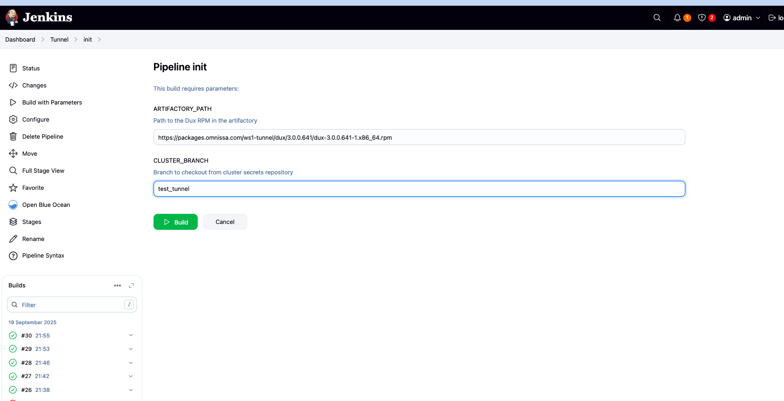

    - 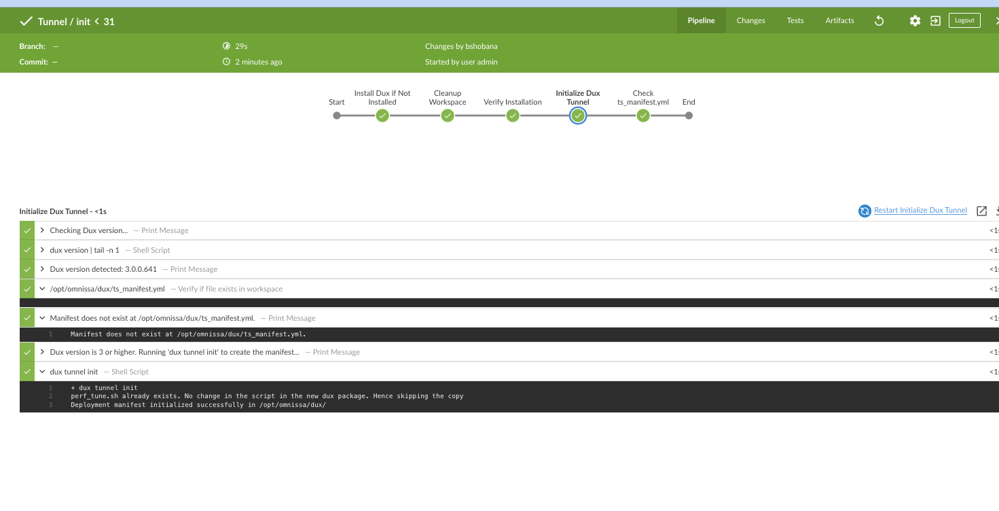

2.  **Tunnel Deploy**

    - Update manifest file and place container image in
      `/opt/omnissa/dux/images`

    - Pipeline checks remote host, runs deploy dry-run, deploys
      container, updates config repo

    - Sample screenshots:

    - 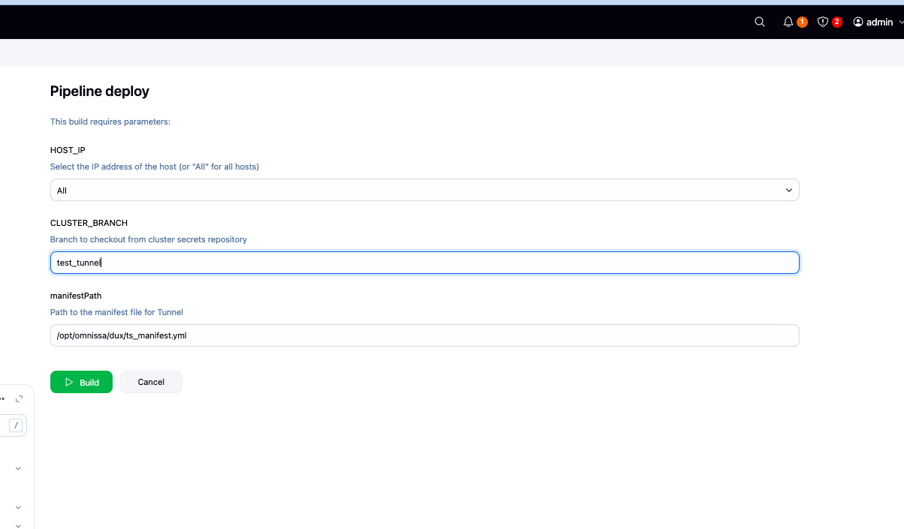(Legacy)

    - 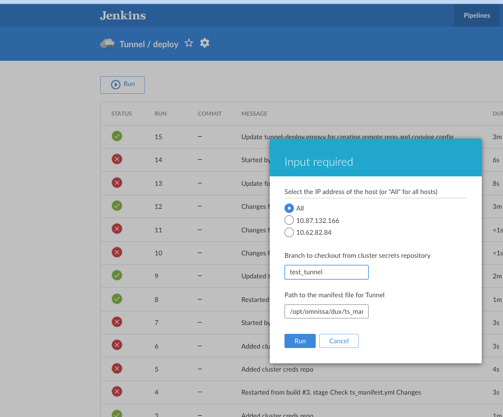(Blue Ocean)

    - 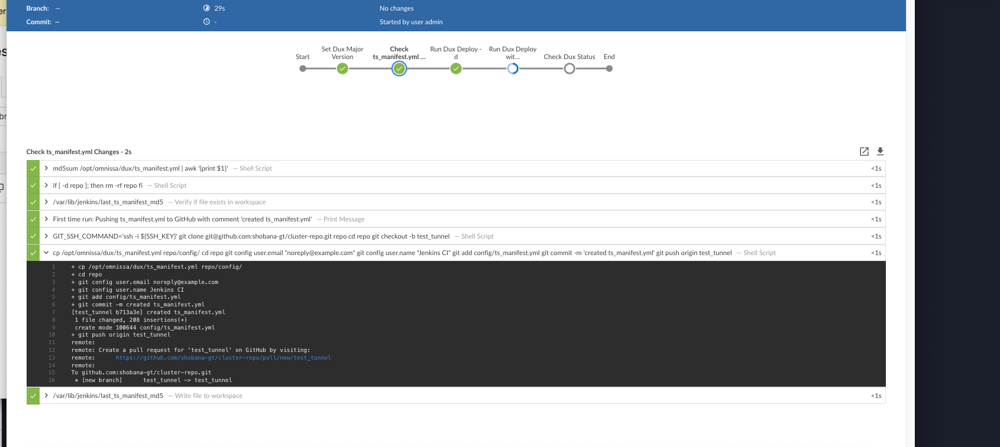

3.  **Tunnel Healthcheck**

    - Runs `dux tunnel status` to check container health

    - 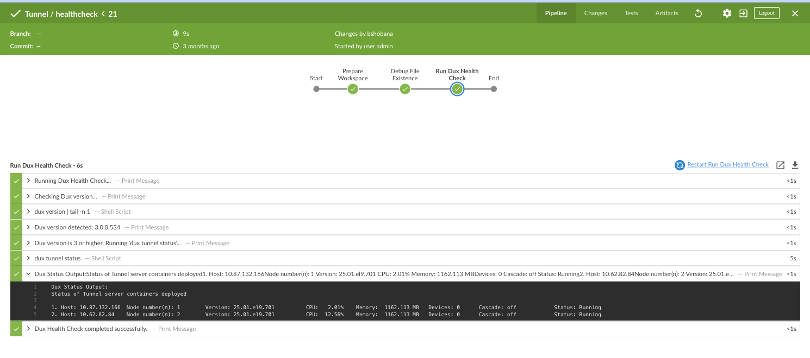

4.  **Tunnel Debug**

    - Runs `dux tunnel logs` and `dux tunnel report` for troubleshooting

    - 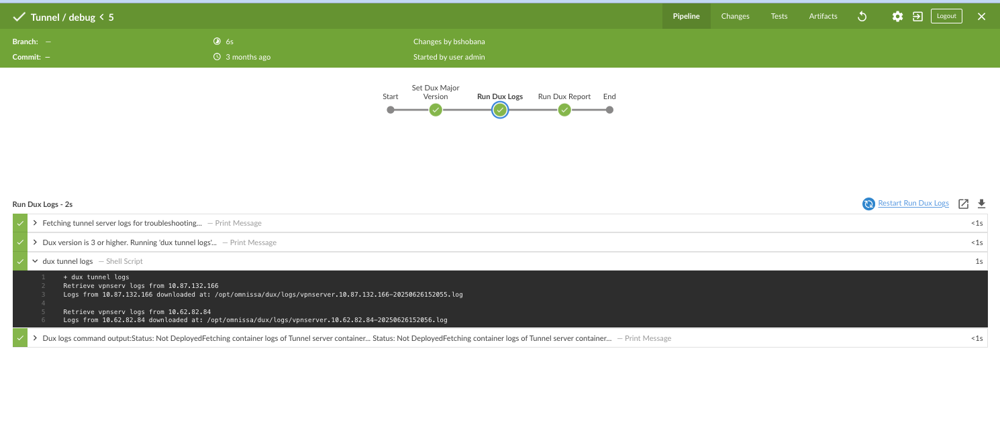

5.  **Stop/Restart/Remove Tunnel Container**

    - Stop: `dux tunnel stop -y ` and `dux tunnel status`

    - 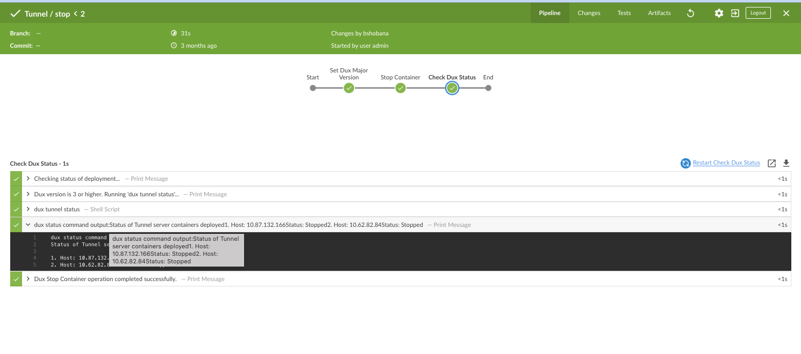

    - Restart: `dux tunnel restart -y` and `dux tunnel status`

    - 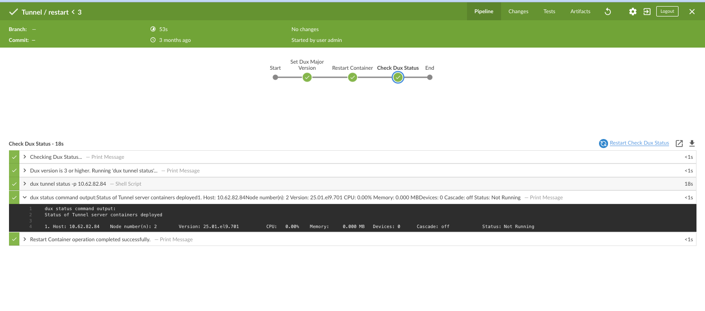

    - Remove: `dux tunnel destroy -y` and `dux tunnel status`

    - 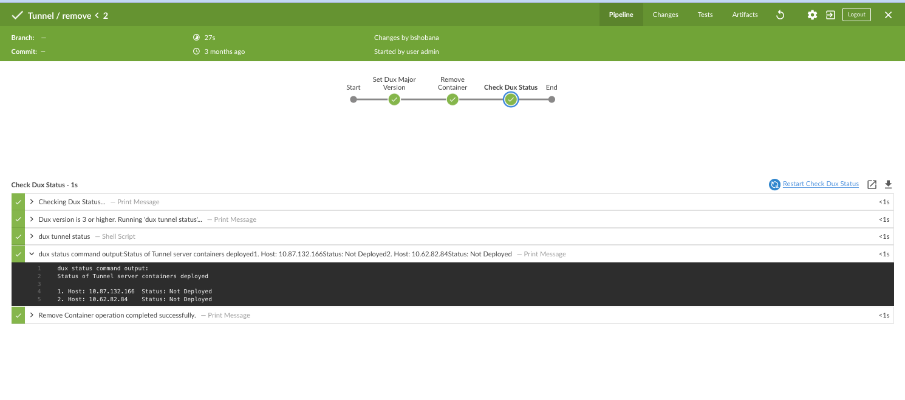

### **EIC Container Operations**

Copy all the needed configuration files (`application.yml, policies.json
and logback.xml`) under `eic-config` directory of the cluster creds repo in
your branch.

Copy the container image for EIC under `/opt/omnissa/dux/images` dir.

EIC Init job would copy the files from the repo to the Dux host under
`/opt/omnissa/dux/eic-config` dir.

All the other jobs are similar to Tunnel jobs. Hence not elaborated. Any
change/update to the config files - `eic_manifest.yml`, or the files under
`eic-config` will be updated in the cluster repo.

### **PacReader Container Operations**

Copy all the needed configuration files (`pacfile.pac`, `pfx.p12`) under
pacreader-config directory of the cluster creds repo in your branch.

Copy the container image for PAC Reader under `/opt/omnissa/dux/images`
dir.

PACReader Init job would copy the files from the repo to the Dux host
under `/opt/omnissa/dux/` dir.

All the other jobs are similar to Tunnel jobs. Hence not elaborated.

### **SEG Container Operations**

All the jobs are similar to Tunnel jobs. Hence not elaborated.

## Troubleshooting

### Common Issues & Solutions

- **SSH Permission Denied :** (`git@github.com: Permission denied
  (publickey)`)

  - Ensure SSH keys are correctly configured and added to GitHub

  - Check permissions on `/var/lib/jenkins/.ssh` and `known_hosts`

- **Jenkins Job Fails Due to Script Approval:**

  - Go to `Manage Jenkins` → `In-process Script Approval` and approve
    required methods

  - In `Manage Jenkins` → `Security`, you can uncheck Enable script security
    for Job DSL scripts to trust operations in seed scripts. If you are
    only using this seed script or any scripts from trusted sources,
    this is OK. But if you are ever running seed script from unknown
    sources, this is not recommended.

- **Docker Permission Issues:**

  - Ensure Jenkins user is in `docker` group and has correct permissions

- **Pipeline Fails on Deploy:**

  - Check manifest file for errors

  - Ensure all prerequisites (Docker, SSH, sudo) are met on target hosts

- **General Jenkins Issues:**

  - Restart Jenkins after plugin installs

  - Check Jenkins logs and Console Output for error details

- **Dux command failures:**

  - Check `/opt/omnissa/dux/logs/dux.log` for debugging.

- **Container issues:**

  - Pull container logs using `Logs` operation and debug the downloaded
    logs.

## Where to Get Help

- **Dux Documentation:** [Dux 3.0
  README](https://packages.omnissa.com/ws1-tunnel/dux/3.0.0.641/README.html)

- **Jenkins Documentation:** [Jenkins Linux Install Guide](https://www.jenkins.io/doc/book/installing/linux/)

- **GitHub Repos:**

  - [GitHub - shobana-gt/dux-jenkins-pipeline](https://github.com/shobana-gt/dux-jenkins-pipeline/tree/jenkins-dux-pipeline)

  - [Sample cluster repo](https://github.com/shobana-gt/sample-cluster-repo)

